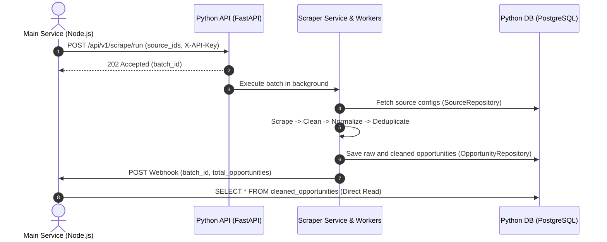

# Levora AI Service — Python Core Service

The **Python Core Service** is an asynchronous backend service in the Levora platform responsible for automated web scraping, data cleaning, normalization, deduplication, AI-driven opportunity matching, and contextual assistant operations.

---

## 1. Architecture & Interaction Model

Following the Levora High-Level Technical Decisions (v2.0):
* **Source Management & Scheduling:** The Main Service (Node.js) manages source configurations and schedules scraping runs by dispatching source IDs to `POST /api/v1/scrape/run`.
* **Technical Source Metadata:** The Python Service reads detailed scraping configurations (endpoints, pagination, field mappings) from its own database (`sources` table).
* **Asynchronous Processing:** Scrape requests execute in the background and respond immediately with `202 Accepted` and a unique `batch_id`.
* **Completion Notification:** Upon completion of a scraping batch, the Python Service dispatches an HTTP Webhook (`ScrapeCompletePayload`) to the Main Service.
* **Direct Read (SSOT Data Access):** The Main Service directly reads cleaned opportunities (`cleaned_opportunities`) and match results (`match_scores`) via a dedicated read-only PostgreSQL user.



---

## 2. Authentication

All private endpoints are secured via **API Key Authentication**.

* **Header Name:** `X-API-Key`
* **Key Storage:** Keys are stored as SHA-256 hashes in the `api_keys` table. The raw key is never stored in plaintext.
* **Key Validation:** Evaluates key presence, active status (`is_active: true`), and expiration (`expires_at > NOW()`). Updates `last_used_at` upon successful verification.

### Generating API Keys
Use the provided CLI script to generate a cryptographically secure key:
```bash
poetry run python scripts/generate_api_key.py "Main Service Production"
```
Output:
```text
API key created.
  name: Main Service Production
  id:   d290f1ee-6c54-4b01-90e6-d701748f0851

  key:  lv_V_7WjL0pQm3xK...

Store this key now. It cannot be recovered later.
```

---

## 3. API Endpoints Reference

### 3.1 Health Check Probe
Checks service liveness and active database connectivity.

* **URL:** `/health`
* **Method:** `GET`
* **Auth Required:** No
* **Responses:**
  * `200 OK`: Database connected and operational.
    ```json
    {
      "status": "ok",
      "database": "connected"
    }
    ```
  * `503 Service Unavailable`: Database query failed.
    ```json
    {
      "status": "degraded",
      "database": "unavailable"
    }
    ```

---

### 3.2 Trigger Scrape Run
Triggers an asynchronous scraping job for specified source IDs.

* **URL:** `/api/v1/scrape/run`
* **Method:** `POST`
* **Auth Required:** Yes (`X-API-Key`)
* **Headers:**
  ```http
  Content-Type: application/json
  X-API-Key: <YOUR_API_KEY>
  ```
* **Request Body:**
  ```json
  {
    "source_ids": [
      "a0eebc99-9c0b-4ef8-bb6d-6bb9bd380a11",
      "b1eebc99-9c0b-4ef8-bb6d-6bb9bd380a22"
    ]
  }
  ```
* **Responses:**
  * `202 Accepted`:
    ```json
    {
      "batch_id": "9f3f9661-8208-4122-a9b8-d2188ff6e4cb",
      "status": "accepted",
      "source_count": 2,
      "message": "Scraping started; a webhook will be sent on completion."
    }
    ```
  * `400 Bad Request`: Validation error (e.g., empty `source_ids` list).
  * `401 Unauthorized`: Missing or invalid API key.

---

### 3.3 Internal Webhook Receiver (Testing & Simulation)
Receives scrape completion notifications (used for internal verification and Main Service mock).

* **URL:** `/api/v1/webhook/scrape-complete`
* **Method:** `POST`
* **Auth Required:** Yes (`X-API-Key`)
* **Request Body:**
  ```json
  {
    "batch_id": "9f3f9661-8208-4122-a9b8-d2188ff6e4cb",
    "total_opportunities": 42,
    "succeeded_sources": ["almin7"],
    "failed_sources": [],
    "completed_at": "2026-09-01T15:30:00Z"
  }
  ```
* **Response:** `200 OK` (`{"status": "received", "batch_id": "..."}`)

---

### 3.4 AI Assistant Chat
Answers a student's question about one opportunity, using only the stored opportunity data and the profile sent with the request. Conversations are stored per user, opportunity and (optionally) application.

* **URL:** `/api/v1/ai/chat`
* **Method:** `POST`
* **Auth Required:** Yes (`X-API-Key`)
* **Request Body:**
  ```json
  {
    "user_id": "3f1c2b4e-8d5a-4c7e-9b1f-2a6d8e0c4b7a",
    "opportunity_id": "a0eebc99-9c0b-4ef8-bb6d-6bb9bd380a11",
    "application_id": null,
    "message": "هل يشترطون شهادة IELTS؟",
    "locale": "ar",
    "profile": {
      "nationality": "Syria",
      "education_level": "Bachelor",
      "field_of_study": "Computer Science",
      "gpa": 3.4,
      "languages": [{"name": "English", "level": "B2"}]
    }
  }
  ```
* **Response `200 OK`:**
  ```json
  {
    "conversation_id": "c9d1...",
    "message_id": "m7a2...",
    "answer": "...",
    "status": "ok",
    "decline_reason": null,
    "official_source_url": "https://www.chevening.org/apply",
    "disclaimer": "هذا التوجيه مقدم للمساعدة فقط ولا يضمن قبول طلبك أو أي نتيجة.",
    "created_at": "2026-09-15T10:00:00Z"
  }
  ```
* `status` is `declined` when the assistant will not answer. `decline_reason` is one of:
  * `missing_eligibility_data` / `unverified_opportunity`: eligibility question without reliable data (answered without calling the model).
  * `insufficient_data`: the model found no answer in the stored data.
  * `guardrail_blocked`: the message was blocked (prompt injection).

  In every declined case `answer` points the student to `official_source_url`.

### 3.5 Essay Review
* **URL:** `/api/v1/ai/essay-review`
* **Method:** `POST`
* **Auth Required:** Yes (`X-API-Key`)
* **Request Body:**
  ```json
  {
    "user_id": "3f1c2b4e-8d5a-4c7e-9b1f-2a6d8e0c4b7a",
    "essay_type": "motivation_letter",
    "essay_text": "...",
    "opportunity_id": "a0eebc99-9c0b-4ef8-bb6d-6bb9bd380a11",
    "locale": "en"
  }
  ```
  `essay_type`: `motivation_letter`, `personal_statement`, `cv`, `research_proposal`, `other`. `essay_text`: 100 to 20,000 characters.
* **Response `200 OK`:** `overall_assessment`, `strengths[]`, `weaknesses[]` (each `{point, evidence}`, where `evidence` is an exact quote from the essay or `null`), `suggestions[]` (`{suggestion, priority}`), `language_issues[]` (`{original, correction, explanation}`), `fit_with_opportunity`, `disclaimer`.

### 3.6 Conversation History
* **URL:** `/api/v1/ai/conversations?user_id=...&opportunity_id=...&application_id=...&limit=50&before=<ISO datetime>`
* **Method:** `GET`
* **Auth Required:** Yes (`X-API-Key`)
* **Response `200 OK`:** `{"conversation_id": "...", "messages": [{"id", "role", "content", "status", "created_at"}], "has_more": false}`. Messages are oldest first; pass the first message's `created_at` as `before` to load older ones.

### 3.7 AI Error Responses
```json
{ "error": { "code": "ai_unavailable", "message": "المساعد غير متاح حالياً. حاول مرة أخرى لاحقاً." } }
```
| Status | Code | When |
| --- | --- | --- |
| 404 | `opportunity_not_found` | Unknown `opportunity_id` |
| 422 | `ai_refused` | The model declined to process the input |
| 429 | `ai_busy` | Rate limited by the model provider |
| 502 | `ai_incomplete` | The model returned no usable output |
| 503 | `ai_unavailable` | Provider unreachable or failing |
| 504 | `ai_timeout` | The model call timed out (`AI_TIMEOUT_SECONDS`) |

The user's message is saved even when the model call fails, so no input is lost.

---

## 4. Webhook Notification (Python Service → Main Service)

When a batch scrape completes, the Python Service dispatches a webhook to the Main Service URL specified in `MAIN_SERVICE_WEBHOOK_URL`.

### Webhook Headers
```http
Content-Type: application/json
X-Webhook-Secret: <MAIN_SERVICE_WEBHOOK_SECRET>
```

### Webhook Payload Schema
```json
{
  "batch_id": "9f3f9661-8208-4122-a9b8-d2188ff6e4cb",
  "total_opportunities": 42,
  "succeeded_sources": [
    "a0eebc99-9c0b-4ef8-bb6d-6bb9bd380a11"
  ],
  "failed_sources": [],
  "completed_at": "2026-09-01T15:30:00.000Z"
}
```

### Resilience & Retry Policy
* Uses `BaseHttpClient` with `RetryStrategy` (up to 4 attempts with exponential backoff).
* Webhook transmission failures are logged but **do not** fail the scraping execution or database transactions.

---

## 5. Main Service Database Read-Only Access

The Main Service reads opportunities directly from the Python database using a restricted PostgreSQL role.

### Provisioning the Read-Only User
Run the setup script against your PostgreSQL instance:
```bash
psql -U postgres -d levora_python -f scripts/create_readonly_user.sql
```

### SQL Permission Grants (`scripts/create_readonly_user.sql`)
```sql
CREATE ROLE levora_main_service WITH LOGIN PASSWORD 'CHANGE_ME_STRONG_PASSWORD';

GRANT CONNECT ON DATABASE postgres TO levora_main_service;
GRANT USAGE ON SCHEMA public TO levora_main_service;

-- Read-only permissions on clean opportunities and match scores
GRANT SELECT ON TABLE public.cleaned_opportunities TO levora_main_service;
GRANT SELECT ON TABLE public.match_scores TO levora_main_service;

-- Explicitly revoke access to internal tables
REVOKE ALL ON TABLE public.sources FROM levora_main_service;
REVOKE ALL ON TABLE public.raw_opportunities FROM levora_main_service;
REVOKE ALL ON TABLE public.api_keys FROM levora_main_service;

ALTER DEFAULT PRIVILEGES IN SCHEMA public REVOKE ALL ON TABLES FROM levora_main_service;
```

---

## 6. Local Setup and Development

### Prerequisites
* Python 3.12+
* Poetry
* PostgreSQL 15+

### Installation & Configuration
1. Clone the repository and install dependencies:
   ```bash
   poetry install
   ```
2. Set up environment variables:
   ```bash
   cp .env.example .env
   # Edit .env with your DATABASE_URL and configurations
   ```
3. Generate the Prisma Client:
   ```bash
   poetry run prisma generate
   ```
4. Run database migrations:
   ```bash
   poetry run prisma migrate dev
   ```

### Running the Application
```bash
poetry run uvicorn src.main:app --host 0.0.0.0 --port 8000 --reload
```
Interactive OpenAPI documentation is available at `http://localhost:8000/docs`.

### Running Tests and Linting
* **Run test suite:**
  ```bash
  poetry run pytest -v
  ```
* **Run coverage analysis:**
  ```bash
  poetry run pytest --cov=src --cov-report=term-missing
  ```
* **Run linting & formatting checks:**
  ```bash
  poetry run ruff check .
  poetry run black --check .
  poetry run mypy src
  ```
